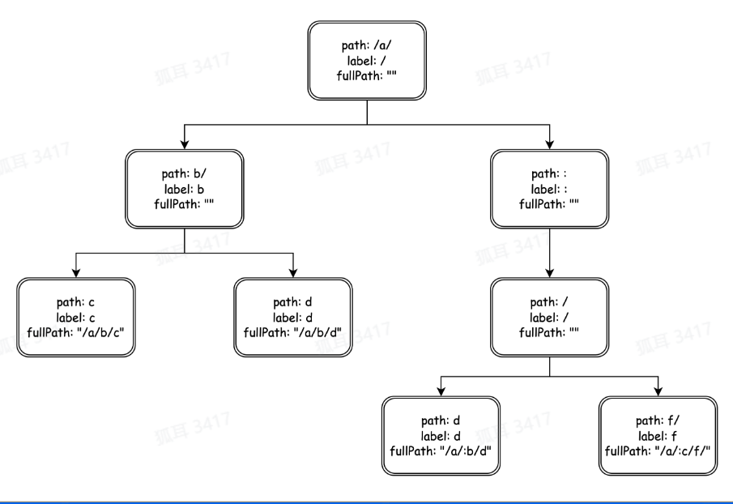

## 再谈HTTP协议

### HTTP协议是什么

全名称超文本传输协议，它不只可以传输简单的text文本，还可以传输图片，音频，视频等等。  

HTTP协议请求报文和响应报文。  

请求报文格式包括请求行，请求头和请求体：  

* 请求行包括方法名，URL和协议版本。常见方法名有GET,POST,HEAD,PUT等等，常见协议版本有HTTP1.0, HTTP1.1等等。  

* 请求头包括协议约定业务相关的一些关键字内容，包括Host，Content-Length，Connection，Content-Type，Content-Encoding等等。  

* 请求体包括想要请求的内容，如post请求提交的表单内容。  

响应报文格式有状态行，响应头，响应体：    

* 状态行包括协议版本，状态码，状态码描述。常见状态码有200，403，404，502，503等等。  
> 1xx 提示信息，表示目前是协议处理的中间状态，还需要后续的操作；  
2xx 成功，报文已经收到并被正确处理；  
3xx 重定向，资源位置发生变动，需要客户端重新发送请求；  
4xx 客户端错误，请求报文有误，服务器无法处理；  
5xx 服务器错误，服务器在处理请求时内部发生了错误。  

* 响应头包括协议约定业务相关的一些关键字内容。  

* 响应体包括响应的内容，如HTML页面，视频资源等等。  

### 不足与展望  

| HTTP 版本 | 特点                                                      |
|-----------|----------------------------------------------------------|
| HTTP/1   | - 头部阻塞 - 传输效率低 - 明文传输不安全           |
| HTTP/2   | - 多路复用 - 头部压缩 - 二进制协议                   |
| QUIC     | - 基于UDP实现 - 解决头部阻塞 - 加密减少握手次数 - 支持快速启动  |

## HTTP框架的设计与实现

### 分层设计

| OSI七层模型   | TCP/IP四层模型 | 网络协议        |
|--------------|---------------|----------------|
| 应用层        | 应用层        | HTTP、SMTP、FTP、TFTP、NFS |
| 表示层        |               | Telnet、Rlogin、SNMP、Gopher               |
| 会话层        |               | SMTP、DNS               |
| 传输层        | 传输层        | TCP、UDP       |
| 网络层        | 网际层        | IP、ICMP、ARP、       |
| 数据链路层    | 网络接口层    | Ethernet、FDDI       |
| 物理层        |               | IEEE 802.A               |

> 专注性，扩展性和复用性

  
> 高内聚，低耦合，易用性，高扩展性  

#### 应用层设计

提供合理的API，可理解并且简单  

#### 中间件设计  

* 配合Handler实现一个完整的请求处理生命周期
* 拥有**预处理逻辑**和**后处理逻辑**
* 可以注册多中间件，低耦合，可插拔式
* 对上层模块用户逻辑模块易用  

洋葱模型，调用链  

#### 路由设计

框架路由就是为URL匹配对应的处理函数(Handlers)  

* 静态路由： /a/b/c、/a/b/d
* 参数路由： /a/:id/c (/a/b/c,/a/d/c)、/*all
* 路由修复：/a/b <-> /a/b/
* 冲突路由以及优先级：/a/b、/:id/c
* 匹配HTTP方法
* 多处理函数：方便添加中间件

**前缀匹配树**    
/a/b/c, /a/b/d, /a/:b/d, /a/:c/f  
 

**如何匹配HTTP方法？如get，post**

Map[string(Method)]前缀树  

外层Map，根据method找到对应的前缀树，再查找路由  

**如何实现添加多处理函数？**  

在每个节点上使用一个list存储handler  

####　协议层设计

对每个协议进行配置，抽象出接口　　

#### 网络层设计  

该框架使用了两种网络库，分别为go net和netpoll

* go net为阻塞性IO，用户管理Buffer  
* netpoll使用非阻塞性IO，网络库管理buffer

### 优化

* 针对网络库的优化：buffer设计
> 分配足够大的buffer，存下全部header且拷贝出完整的Body  

* 针对协议的优化：header解析，热点资源优化
> SIMD技术进行header解析

参考资料：
https://juejin.cn/course/bytetech/7142811324462923783/section/7142810214532644872